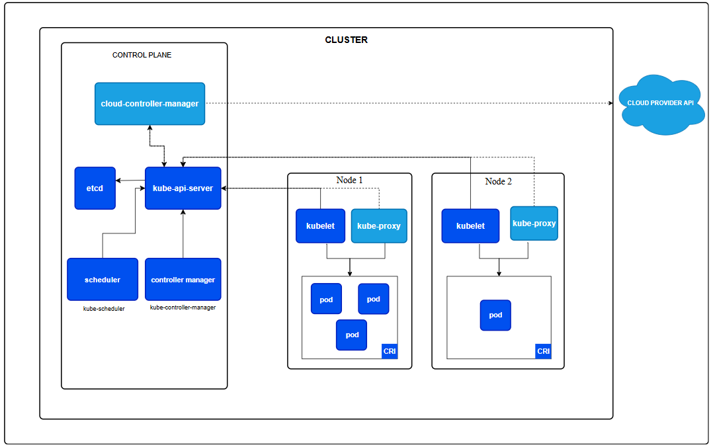
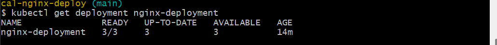
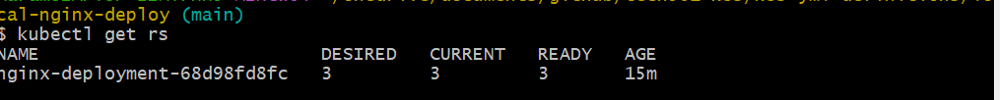
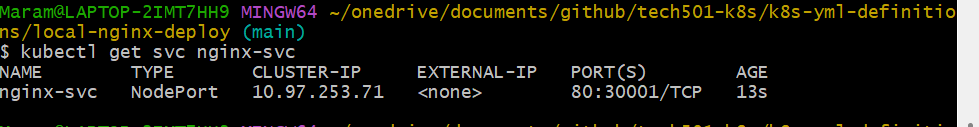
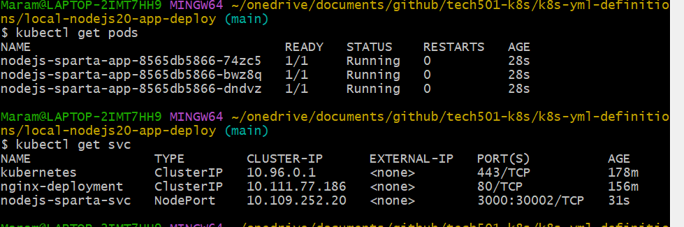
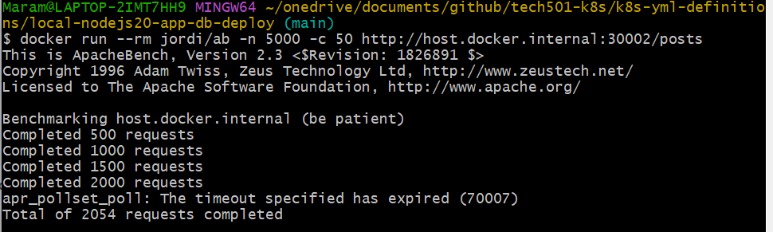
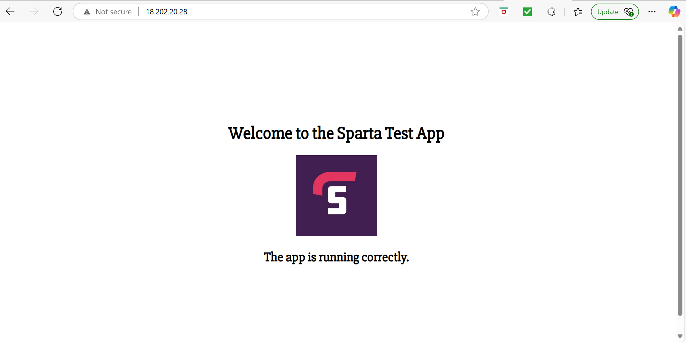

## Table of Contents

- [Kubernetes Research](#kubernetes-research)  
- [Kubernetes Architecture](#kubernetes-architecture)  
- [The Cluster Setup](#the-cluster-setup)  
- [Kubernetes Objects](#kubernetes-objects)  
- [Security Concerns with Containers](#security-concerns-with-containers)  
- [Maintained Images](#maintained-images)  
- [Task: Get Kubernetes Running Using Docker Desktop](#task-get-kubernetes-running-using-docker-desktop)  
- [Kubernetes Tasks Summary](#kubernetes-tasks-summary)  
- [Task: Create Nginx Deployment Only](#task-create-nginx-deployment-only)  
- [Task: Create a NodePort Service for Nginx](#task-create-a-nodeport-service-for-nginx)  
- [Task: See What Happens When a Pod is Deleted](#task-see-what-happens-when-a-pod-is-deleted)  
- [Task: Increase Replicas with No Downtime](#task-increase-replicas-with-no-downtime)  
- [Task: Delete Kubernetes Deployments and Services](#task-delete-kubernetes-deployments-and-services)  
- [Task: Deploy NodeJS Sparta Test App in Kubernetes](#task-deploy-nodejs-sparta-test-app-in-kubernetes)  
- [Task: Add MongoDB Deployment & Persistent Volume](#task-add-mongodb-deployment--persistent-volume)  
- [Task: Horizontal Pod Autoscaler (HPA) for NodeJS App](#task-horizontal-pod-autoscaler-hpa-for-nodejs-app)  
- [Minikube Multi-App Deployment Log](#minikube-multi-app-deployment-log)  
- [Deploying a Containerized 2-Tier Application on Minikube](#deploying-a-containerized-2-tier-application-on-minikube)  

 

# Kubernetes Research

## Why is Kubernetes Needed?
Kubernetes is an open-source platform designed to automate the deployment, scaling, and management of containerized applications. Modern applications often use microservices, which run in containers. Managing these containers at scale requires automation, which Kubernetes provides.

## Benefits of Kubernetes
- **Scalability**: Adjusts container numbers based on demand.
- **Portability**: Works across on-premises, hybrid, and multiple clouds.
- **High Availability**: Ensures application stability through redundancy.
- **Resource Efficiency**: Optimizes resource allocation.
- **Declarative Configuration**: Defines desired state and self-heals.

## Success Stories
- **Pokemon Go**: Managed massive user load effectively.
- **Airbnb**: Improved deployment efficiency.
- **New York Times**: Enhanced content delivery.

## Kubernetes Architecture
Kubernetes follows a **master-worker architecture** with a control plane managing worker nodes.

### Control Plane Components
- **kube-apiserver**: Exposes the API.
- **etcd**: Stores cluster data.
- **kube-scheduler**: Assigns pods to nodes.
- **kube-controller-manager**: Manages controllers.

### Worker Node Components
- **kubelet**: Ensures containers run properly.
- **kube-proxy**: Manages networking.
- **Container Runtime**: Runs containers (Docker).

## The Cluster Setup

### What is a Cluster?
A Kubernetes cluster consists of a **control plane** and multiple **worker nodes** to run applications.

### Master vs. Worker Nodes
- **Master Node (Control Plane)**: Manages scheduling and scaling.
- **Worker Nodes**: Run applications and workloads.


   


### Managed vs. Self-Managed Kubernetes
#### Managed (e.g., GKE, EKS)
**Pros:**
- Simplifies management
- Easier scaling
- Cloud integration

**Cons:**
- Higher cost
- Limited control

#### Self-Managed Kubernetes
**Pros:**
- Full customization
- Cost efficiency

**Cons:**
- Complex setup
- Higher operational overhead

### Control Plane vs. Data Plane
- **Control Plane**: Manages cluster state.
- **Data Plane**: Runs workloads.

## Kubernetes Objects
### Common Kubernetes Objects
- **Pods**: The smallest deployable unit.
- **ReplicaSets**: Maintain a set number of running pods.
- **Deployments**: Manage ReplicaSets and updates.

### What Does It Mean That a Pod is "Ephemeral"?
Pods are **temporary** and can be replaced anytime by Kubernetes if needed.

## Security Concerns with Containers
- **Network Security**: Use **Network Policies**.
- **Least Privilege Access**: Implement **RBAC**.
- **Image Security**: Scan and sign images.
- **Runtime Security**: Use tools like **Falco**.

## Maintained Images
### What Are Maintained Images?
Container images that are regularly updated and supported.

### Pros and Cons
**Pros:**
- Security updates
- Stability
- Community support

**Cons:**
- Limited customization
- May include unwanted dependencies


# Task: Get Kubernetes Running Using Docker Desktop

## **Step 1: Check if Kubernetes is Running**
1. Open **Git Bash** (Windows).
2. Run the following command to check if Kubernetes is active:
   ```sh
   kubectl get service
   ```
3. If Kubernetes is **not running**, you will see an error message indicating that it cannot connect to the cluster.
4. Leave this terminal window open for later steps.

---

## **Step 2: Enable Kubernetes in Docker Desktop**
1. **Open Docker Desktop**.
2. Click on the **Settings icon** in the top-right corner.
3. Navigate to the **Kubernetes** tab.
4. **Enable Kubernetes** by checking the box.
5. Click **Apply & Restart**.


---

## **Step 3: Verify Kubernetes is Running**
1. Once Docker Desktop restarts, go back to the terminal window.
2. Run the following command again:
   ```sh
   kubectl get nodes
   ```
3. If Kubernetes is running, you should see a node named `docker-desktop` in the output.


---

## **Step 4: Update `kubectl` Configuration**
1. Ensure that `kubectl` is pointing to the correct Kubernetes context:
   ```sh
   kubectl config current-context
   ```
   - If the output is **not** `docker-desktop`, update it with:
     ```sh
     kubectl config use-context docker-desktop
     ```


---

# Kubernetes Tasks Summary
## Task: Create Nginx Deployment Only

## **Step 1: Create a YAML file**
Create a new file named `nginx-deploy.yml`.

## **Step 2: Define the Deployment in YAML**
```yaml
apiVersion: apps/v1
kind: Deployment
metadata:
  name: nginx-deployment
  labels:
    app: nginx
spec:
  replicas: 3
  selector:
    matchLabels:
      app: nginx
  template:
    metadata:
      labels:
        app: nginx
    spec:
      containers:
      - name: nginx
        image: daraymonsta/nginx-257:dreamteam
        ports:
        - containerPort: 80
```

## **Step 3: Apply the Deployment**
Run the following command to create the deployment:
```sh
kubectl apply -f nginx-deploy.yml
```

## **Step 4: Get Deployment Details**
Run the following commands to retrieve details:

- **Deployment details:**
  ```sh
  kubectl get deployment nginx-deployment
  ```


  

- **ReplicaSets details:**
  ```sh
  kubectl get rs
  ```
  

- **Pods details:**
  ```sh
  kubectl get pods
  ```
  

  
- **All three at once:**
  ```sh
  kubectl get all
  ```
  

## **Step 5: Connect to Deployment in Browser**
### **Using ClusterIP (Default)**
1. Run:
   ```sh
   kubectl expose deployment nginx-deployment --type=ClusterIP --port=80
   ```
2. Check the service:
   ```sh
   kubectl get svc nginx-deployment
   ```
   

3. Test inside the cluster:
   ```sh
   kubectl run test-pod --image=busybox -it --rm --restart=Never -- wget -O- nginx-deployment
   ```


   

### **If You Can’t Connect, Possible Reasons:**
- **ClusterIP services are only accessible within the cluster.**, therefore no external IP is available. use port forwarding or expose the deployment using Nodeport Service.
- **Firewall restrictions blocking the port.** 
- **Pods are not running or in a crash loop.**

---
# Task: Create a NodePort Service for Nginx

## **Step 1: Create a YAML file**
Create a new file named `nginx-service.yml` inside your repository `tech501-k8s` under the subfolder:

```
k8s-yaml-definitions/local-nginx-deploy/
```

## **Step 2: Define the NodePort Service in YAML**
```yaml
apiVersion: v1
kind: Service
metadata:
  name: nginx-svc
spec:
  type: NodePort
  selector:
    app: nginx
  ports:
    - protocol: TCP
      port: 80
      targetPort: 80
      nodePort: 30001
```

## **Step 3: Apply the Service**
Run the following command to create the service:
```sh
kubectl apply -f nginx-service.yml
```

## **Step 4: Verify Service is Running**
Run the following command to check the services:
```sh
kubectl get svc nginx-svc
```


  

## **Step 5: Test Access in Browser**
Open your web browser and go to:
```
http://localhost:30001
```

  
Or use your node’s IP:
```
http://<node-ip>:30001
```

---

### **Task: See What Happens When a Pod is Deleted**

1. **Listed running pods:**
    ```sh
    kubectl get pods
    ```

2. **Deleted one of the pods:**
    ```sh
    kubectl delete pod <pod-name>
    ```    
3. **Checked if a new pod was created:**
    ```sh
    kubectl get pods
    ```
- a new pod is created when a pod is deleted to keep the desired number of pods in place.

   
    
4. **Fetched detailed information about the newest pod:**
    ```sh
    kubectl describe pod <pod-name>
    ```
   
---

# Task: Increase Replicas with No Downtime

## **Rationale**
- We want to **increase the number of replicas (pods)** in our deployment **without downtime** to ensure high availability. 
- Kubernetes provides multiple ways to **scale a deployment** dynamically.

---

## **Method 1: Edit the Deployment in Real-Time**

1. Use the following command to edit the deployment interactively:
   ```sh
   kubectl edit deployment nginx-deployment
   ```
2. Locate the `spec.replicas` field and change the value to `4`:
   ```yaml
   spec:
     replicas: 4
   ```
3. Save and exit the editor.
4. Verify that the replicas have increased:
   ```sh
   kubectl get deployment nginx-deployment
   ```


   

---

## **Method 2: Apply a Modified Deployment File**

1. Edit the existing **nginx-deploy.yml** file.
2. Change the `replicas` field to `5`:
   ```yaml
   spec:
     replicas: 5
   ```
3. Apply the changes without deleting the existing deployment:
   ```sh
   kubectl apply -f nginx-deploy.yml
   ```
4. Verify the number of replicas:
   ```sh
   kubectl get deployment nginx-deployment
   ```
  
  

---

## **Method 3: Use the Scale Command**

1. Scale the deployment from 5 to 6 replicas using:
   ```sh
   kubectl scale deployment nginx-deployment --replicas=6
   ```
2. Verify the scaling:
   ```sh
   kubectl get deployment nginx-deployment
   ```

  
---

# Task: Delete Kubernetes Deployments and Services

## **Step 1: Delete Using YAML Manifest Files**
To delete both the **nginx-deployment** Deployment and **nginx-svc** Service using the YAML files where they were defined, run:
```sh
kubectl delete -f nginx-deploy.yml
kubectl delete -f nginx-service.yml
```

## **Step 2: Verify Deletion**
Check if the deployment, ReplicaSets, and pods have been removed:
```sh
kubectl get deployments
kubectl get rs  # Check if ReplicaSets are gone
kubectl get pods
```
Check if the service has been deleted:
```sh
kubectl get svc
```

Expected output:
- The **deployment, ReplicaSets, and pods** should no longer appear in the `kubectl get` output.
- The **service** should no longer be listed under `kubectl get svc`.


   

---

# **Task: Deploy NodeJS Sparta Test App in Kubernetes**

#### **Step 1: Created Deployment & Service YAMLs**

**`nodejs-deploy.yml`**
```yaml
apiVersion: apps/v1
kind: Deployment
metadata:
  name: nodejs-sparta-app
spec:
  replicas: 3
  selector:
    matchLabels:
      app: nodejs-sparta
  template:
    metadata:
      labels:
        app: nodejs-sparta
    spec:
      containers:
      - name: nodejs-sparta
        image: mrmri9/sparta-node:v2
        workingDir: /usr/src/app # Set correct working directory
        command: ["/bin/sh", "-c"]
        args:
          - "node seeds/seed.js && node app.js"
        ports:
        - containerPort: 3000
        env:
        - name: DB_HOST
          value: "mongodb://mongo-service:27017/sparta"
```

**`nodejs-service.yml`**
```yaml
apiVersion: v1
kind: Service
metadata:
  name: nodejs-sparta-svc
spec:
  type: NodePort
  selector:
    app: nodejs-sparta
  ports:
    - protocol: TCP
      port: 3000
      targetPort: 3000
      nodePort: 30002  # Accessible at http://localhost:30002
```

#### **Step 2: Applied the Deployment & Service**
```sh
kubectl apply -f nodejs-deploy.yml
kubectl apply -f nodejs-service.yml
```
   

   


#### **Step 3: Deploy MongoDB**

**`mongo-deploy.yml`**
```yaml
apiVersion: apps/v1
kind: Deployment
metadata:
  name: mongo-db
spec:
  replicas: 1
  selector:
    matchLabels:
      app: mongo
  template:
    metadata:
      labels:
        app: mongo
    spec:
      containers:
      - name: mongo
        image: mongo:latest
        ports:
        - containerPort: 27017
```

**`mongo-service.yml`**
```yaml
apiVersion: v1
kind: Service
metadata:
  name: mongo-service
spec:
  type: ClusterIP
  selector:
    app: mongo
  ports:
    - port: 27017
      targetPort: 27017
```

#### **Step 4: Apply MongoDB Deployment**
```sh
kubectl apply -f mongo-deploy.yml
kubectl apply -f mongo-service.yml
```

#### **Step 5: Verified the App is Running**
```sh
kubectl get all
```

   
   
   

---

# **Task: Add MongoDB Deployment & Persistent Volume**

**`mongo-deploy.yml`**
```yaml
apiVersion: apps/v1
kind: Deployment
metadata:
  name: mongo-db
spec:
  replicas: 1
  selector:
    matchLabels:
      app: mongo
  template:
    metadata:
      labels:
        app: mongo
    spec:
      containers:
      - name: mongo
        image: mongo:latest
        ports:
        - containerPort: 27017
        volumeMounts:
        - mountPath: /data/db
          name: mongo-storage
      volumes:
      - name: mongo-storage
        persistentVolumeClaim:
          claimName: mongo-pvc
```

#### **Step 4: Created Persistent Volume & Claim**
```yaml
apiVersion: v1
kind: PersistentVolumeClaim
metadata:
  name: mongo-pvc
spec:
  accessModes:
    - ReadWriteOnce
  resources:
    requests:
      storage: 1Gi
  storageClassName: ""
  volumeName: mongo-pv
```

#### **Step 5: Applied and Verified MongoDB Data Retention**
```sh
kubectl apply -f mongo-deploy.yml
kubectl apply -f mongo-pvc.yml
kubectl exec -it mongo-db-XXXXX -- mongosh
use sparta
db.posts.find().pretty()
```

---

# **Task: Horizontal Pod Autoscaler (HPA) for NodeJS App**

1. **Configured Resource Limits in `nodejs-deploy.yml`**
```yaml
resources:
  requests:
    cpu: "100m"
  limits:
    cpu: "500m"
```
2. **Deployed the HPA**
```sh
kubectl autoscale deployment nodejs-sparta-app --cpu-percent=50 --min=2 --max=10
```
3. **Tested Load Using Apache Bench (ab)**
```sh
docker run --rm jordi/ab -n 5000 -c 50 http://host.docker.internal:30002/posts
```
   


4. **Checked HPA Scaling**
```sh
kubectl get hpa 
```

  

   

   
   


   


# **Minikube Multi-App Deployment Log**

## **Objective**
Deploy **three applications** on a single cloud instance running **Minikube**, ensuring that each app is accessible externally via different endpoints.


### **1️ Setting Up Minikube on EC2**
- Installed Minikube with `none` driver (since we are running it directly on EC2).
- Installed required dependencies:
  - `kubectl`
  - `minikube`
  - `docker`

#### **Steps to Install and Start Minikube on the Cloud Instance**
1. **Update and install dependencies:**
   ```sh
   sudo apt update && sudo apt upgrade -y
   sudo apt install -y curl wget apt-transport-https conntrack
   ```
2. **Install Docker:**
   ```sh
   sudo apt install -y docker.io
   sudo usermod -aG docker $USER
   ```
3. **Download and install Minikube:**
   ```sh
   curl -LO https://storage.googleapis.com/minikube/releases/latest/minikube-linux-amd64
   sudo install minikube-linux-amd64 /usr/local/bin/minikube
   ```
4. **Start Minikube:**
   ```sh
   minikube start --driver=none
   ```
5. **Verify installation:**
   ```sh
   kubectl get nodes
   ```

### **2️ Deploying First Application (NodePort Service)**
- **App Image:** `daraymonsta/nginx-257:dreamteam`
- **Replicas:** 5
- **Exposed via NodePort (`30001`)**
- Created **Deployment YAML (`app1-deployment.yaml`)**:
  ```yaml
  apiVersion: apps/v1
  kind: Deployment
  metadata:
    name: nginx-app
  spec:
    replicas: 5
    selector:
      matchLabels:
        app: nginx-app
    template:
      metadata:
        labels:
          app: nginx-app
      spec:
        containers:
        - name: nginx-container
          image: daraymonsta/nginx-257:dreamteam
          ports:
          - containerPort: 80
  ```
- Created **Service YAML (`app1-service.yaml`)**:
  ```yaml
  apiVersion: v1
  kind: Service
  metadata:
    name: nginx-service
  spec:
    type: NodePort
    selector:
      app: nginx-app
    ports:
      - protocol: TCP
        port: 80
        targetPort: 80
        nodePort: 30001
  ```
- Deployed the app:
  ```bash
  kubectl apply -f app1-deployment.yaml
  kubectl apply -f app1-service.yaml
  ```


### **3️ Configuring Nginx Reverse Proxy for First App**
- Installed Nginx and configured the reverse proxy to **expose the first app externally on `http://<EC2-public-IP>`**.
- Updated `/etc/nginx/sites-available/default`:
  ```nginx
  server {
      listen 80;
      server_name _;
      location / {
          proxy_pass http://192.168.49.2:30001;
      }
  }
  ```
- Restarted Nginx:
  ```bash
  sudo systemctl restart nginx
  ```
- **Verified External Access:**
  ```bash
  curl http://<EC2-public-IP>
  ```
    
    


### **4️ Deploying Second Application (LoadBalancer Service)**
- **App Image:** `daraymonsta/tech201-nginx-auto:v1`
- **Replicas:** 2
- **Exposed via LoadBalancer (`port 9000`, NodePort `30002`)**
- Created **Deployment YAML (`app2-deployment.yaml`)**:
  ```yaml
  apiVersion: apps/v1
  kind: Deployment
  metadata:
    name: app2-nginx
  spec:
    replicas: 2
    selector:
      matchLabels:
        app: app2-nginx
    template:
      metadata:
        labels:
          app: app2-nginx
      spec:
        containers:
        - name: app2-container
          image: daraymonsta/tech201-nginx-auto:v1
          ports:
          - containerPort: 80
  ```
- Created **Service YAML (`app2-service.yaml`)**:
  ```yaml
  apiVersion: v1
  kind: Service
  metadata:
    name: app2-service
  spec:
    type: LoadBalancer
    selector:
      app: app2-nginx
    ports:
      - protocol: TCP
        port: 9000
        targetPort: 80
        nodePort: 30002
  ```
- Deployed the app:
  ```bash
  kubectl apply -f app2-deployment.yaml
  kubectl apply -f app2-service.yaml
  ```
- **Started Minikube Tunnel to Support LoadBalancer Services**:
  ```bash
  minikube tunnel
  ```
- **Verified Internal Access:**
  ```bash
  curl http://10.106.186.126:9000
  ```

### **5️ Configuring Nginx Reverse Proxy for Second App**
- Updated `/etc/nginx/sites-available/default`:
  ```nginx
  server {
      listen 9000;
      server_name _;
      location / {
          proxy_pass http://10.106.186.126:9000;
      }
  }
  ```
- Restarted Nginx:
  ```bash
  sudo systemctl restart nginx
  ```
- **Verified External Access:**
  ```bash
  curl http://<EC2-public-IP>:9000
  ```

   

---

#### **Third App: Hello Minikube (LoadBalancer Service on Port 8080)**
- **Follow [official docs](https://kubernetes.io/docs/tutorials/hello-minikube/)**
- **Service Type:** `LoadBalancer`
- **Use existing Minikube tunnel**
- **Expose the app externally via reverse proxy on `<instance-public-IP>/hello`**

**Step 1: Install `kubectl`**
```sh
sudo snap install kubectl --classic
```
**Step 2: Deploy Hello Minikube**
```sh
kubectl create deployment hello-node --image=registry.k8s.io/e2e-test-images/agnhost:2.39 -- /agnhost netexec --http-port=8080
```
**Step 3: Verify Deployment and Pod Creation**
```sh
kubectl get deployments
kubectl get pods
```
**Step 4: Expose Hello Minikube as a LoadBalancer Service**
```sh
kubectl expose deployment hello-node --type=LoadBalancer --port=8080
```
**Step 5: Verify Service Creation**
```sh
kubectl get services
```
**Step 6: Start Minikube Tunnel to Simulate a Load Balancer**
Since Minikube does not natively support cloud LoadBalancers, we use a tunnel:
```sh
minikube tunnel
```
**Step 7: Verify the App is Running**
```sh
minikube service hello-node
```
Since there’s no browser installed on the VM, run:
```sh
curl <URL-from-minikube-service-command>
```
**Step 8: Configure Nginx Reverse Proxy**
Edit `/etc/nginx/sites-available/default` and add:
```nginx
server {
    listen 80;
    location /hello {
        proxy_pass http://127.0.0.1:8080;
    }
}
```
**Step 9: Restart Nginx**
```sh
sudo nginx -t
sudo systemctl restart nginx
```
**Step 10: Test the Deployment**
Visit:
```
http://<instance-public-IP>/hello
```
---

### **Why Use Minikube Tunnel?**
- Emulates a **LoadBalancer** on a **single-node Kubernetes cluster**.
- Required for **LoadBalancer services** in Minikube since there's no real cloud provider.
- Ensures external traffic can reach **Kubernetes services**.


# Deploying a Containerized 2-Tier Application on Minikube

## Overview
This guide provides step-by-step instructions to deploy a 2-tier application (Node.js app and MongoDB database) on a single VM using Minikube. The deployment includes persistent storage, autoscaling, and external access via a reverse proxy.

## Prerequisites
- An EC2 instance with Ubuntu 22.04
- Docker installed
- Minikube installed and configured to use Docker as the driver
- kubectl installed
- Nginx installed for reverse proxy

## Step 1: Start Minikube
Ensure Minikube starts automatically on VM reboot by creating a systemd service.

### Create Systemd Service for Minikube

```ini
sudo nano /etc/systemd/system/minikube.service
```

Add the following content:

```ini
[Unit]
Description=Minikube
After=network.target docker.service
Requires=docker.service

[Service]
User=ubuntu
ExecStartPre=/bin/sleep 15  # Ensures Docker is ready before starting Minikube
ExecStart=/usr/local/bin/minikube start --driver=docker --memory=1900 --cpus=2 --wait=all
ExecStop=/usr/local/bin/minikube stop
Restart=always
RestartSec=10

[Install]
WantedBy=multi-user.target
```

Enable and start the service:

```sh
sudo systemctl daemon-reload
sudo systemctl enable minikube
sudo systemctl restart minikube
```

Reboot the instance and verify Minikube starts automatically:

```sh
sudo reboot
```

After reboot:

```sh
minikube status
kubectl get nodes
```


## Step 2: Configure Persistent Volume for MongoDB
Create a Persistent Volume (PV) and Persistent Volume Claim (PVC) to provide 100MB storage for MongoDB.

```yaml
apiVersion: v1
kind: PersistentVolume
metadata:
  name: mongo-pv
spec:
  capacity:
    storage: 100Mi
  accessModes:
    - ReadWriteOnce
  hostPath:
    path: "/mnt/data"
---
apiVersion: v1
kind: PersistentVolumeClaim
metadata:
  name: mongo-pvc
spec:
  accessModes:
    - ReadWriteOnce
  resources:
    requests:
      storage: 100Mi
```

Apply the configuration:

```sh
kubectl apply -f mongo-pv.yaml
```

## Step 3: Deploy MongoDB
Create a MongoDB deployment using the persistent storage.

```yaml
apiVersion: apps/v1
kind: Deployment
metadata:
  name: mongo
spec:
  replicas: 1
  selector:
    matchLabels:
      app: mongo
  template:
    metadata:
      labels:
        app: mongo
    spec:
      containers:
      - name: mongo
        image: mongo:5.0
        ports:
        - containerPort: 27017
        volumeMounts:
        - name: mongo-storage
          mountPath: /data/db
      volumes:
      - name: mongo-storage
        persistentVolumeClaim:
          claimName: mongo-pvc
```

Apply the configuration:

```sh
kubectl apply -f mongo-deployment.yaml
```

## Step 4: Deploy the Node.js Application
Create a deployment for the application and configure Horizontal Pod Autoscaler (HPA).

```yaml
apiVersion: apps/v1
kind: Deployment
metadata:
  name: sparta-app
spec:
  replicas: 2
  selector:
    matchLabels:
      app: sparta
  template:
    metadata:
      labels:
        app: sparta
    spec:
      containers:
      - name: sparta-app
        image: mrmri9/sparta-node:v2
        ports:
        - containerPort: 3000
        resources:
          requests:
            cpu: "50m"
            memory: "64Mi"
          limits:
            cpu: "500m"
            memory: "256Mi"
        env:
        - name: DB_HOST
          value: "mongodb://mongo-service:27017/mydatabase"
```

Apply the deployment:

```sh
kubectl apply -f sparta-app.yaml
```

## Step 5: Configure HPA
Create an HPA to scale the application from 2 to 10 replicas based on CPU usage.

```sh
kubectl autoscale deployment sparta-app --cpu-percent=50 --min=2 --max=10
```

Verify HPA is working:

```sh
kubectl get hpa
kubectl describe hpa sparta-app
```

Run a load test to validate scaling:

```sh
kubectl run -it --rm load-gen --image=busybox -- /bin/sh -c "while true; do wget -q -O- http://sparta-service.default.svc.cluster.local; done"
```

Check if replicas increase:

```sh
kubectl get pods
kubectl top pods
```


## Step 6: Expose the Application via NodePort
Create a service to expose the app.

```yaml
apiVersion: v1
kind: Service
metadata:
  name: sparta-service
spec:
  type: NodePort
  ports:
    - port: 3000
      targetPort: 3000
      nodePort: 30008
  selector:
    app: sparta
```

Apply the service:

```sh
kubectl apply -f sparta-service.yaml
```

Find the Minikube IP:

```sh
minikube ip
```

Access the app at:

```sh
http://<MINIKUBE_IP>:30008
```

## Step 7: Set Up Nginx Reverse Proxy
Edit the Nginx config:

```sh
sudo nano /etc/nginx/sites-available/default
```

Add:

```nginx
server {
    listen 80;
    location / {
        proxy_pass http://<MINIKUBE_IP>:30008;
    }
}
```

Restart Nginx:

```sh
sudo systemctl restart nginx
```

Now, access the app via the public IP of the EC2 instance:

```sh
http://<EC2_PUBLIC_IP>
```

  


  


